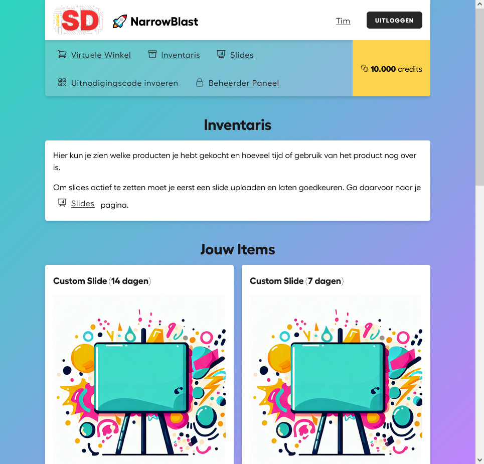

# SD NarrowBlast

With NarrowBlast:
* Our students can create (interactive) slides for narrowcasting using HTML, CSS and optionally JavaScript
* Our students earn credits (weekly) by showing great attendance
* Our students Spend credits to enhance their slides. 
* Our teachers moderate the student slides
* Our teachers can add their own slides to the rotation

## 📸 Screenshot


## 🎇 Available Shop Items

* **Custom Slide time:**

    After a students has uploaded a slide and had it approved, they can purchase and use slide time to display that slide.
    
    *This item expires after a certain duration. The current durations available are either 1, 7 or 14 days.*

* **Power-up: JavaScript Slide:**
    
    Allows a student to enhance their slide with JavaScript. This is useful for adding animated elements to the slide. Students select a slide that is currently active (has slide time applied). JavaScrip will be enabled for this slide permanently.
    
    *This is a single use item which cannot be retrieved from a slide.*

### Coming soon...

When we've been up and running for a couple months, we'll add the following features:

* **Power-up: Slide Invite System:**

    Students can use JavaScript in their slide (included with the power-up) to request an invite/QR-code to display on their slide. Users that scan the QR-code or visit the invite link will 'join the slide'. The student that created the slide can decide:
    * How many users can join the slide
    * What is the credit entry fee for joining the slide
    * How is the credit entry fee distributed among the users that joined the slide

    This allows for students to create interactive slides that can be used for:
    * Quizzes
    * Games
    * Polls
    * ... and more


## 🛠 Getting Started

### Local development
* Clone this repository
* Run the following commands in the root of that repo:
    * `composer install`
    * `npm install`
    * Create and configure the `.env` file:
        * Fill `AMO_CLIENT_ID` and `AMO_CLIENT_SECRET` with the correct (secret) app secrets for the [amoclient OpenID auth](https://github.com/StudioKaa/amoclient)
        * Fill `SLIDE_SHOW_SECRET_TICK_KEY` with a random secret string. This is used to prevent spamming of the slideshow tick endpoint. When setting up a narrowcasting screen you will have to enter this.
        * Fill `USER_CONTENT_PATH` with the path to the directory where uploaded files should be stored. This directory should be accessible by the webserver.
        * Fill `USER_CONTENT_URL` with the URL to the directory where uploaded files should be accessible from. This domain should be different from the domain where the website is hosted. This is to prevent XSS attacks.
        * Set `DISABLE_INVITE_SYSTEM` to `true` to disable the invite system. We will enable this at a later stage.
    * `php artisan storage:link` (needed for shop images)
    * `php artisan migrate --seed` (The seeder automatically adds the shop items and 1 screen)
    * `npm run watch`
    * `php artisan serve`

The website is now available for:

* Narrowcasting: `https://narrowblast.curio.codes/screen/1`
* Students and teachers can login to add slides and spend credits: `https://narrowblast.curio.codes/`
* Teachers can manage through the filament admin panel: `https://narrowblast.curio.codes/admin`

*Replace `https://narrowblast.curio.codes` with `http://localhost:8000` if you are running locally*

#### Local Development Notes:

##### cURL error 60: SSL certificate expired
Since you're running locally, you must disable SSL verification. This is done by applying the following workaround:
* Change line `28` in `/vendor/studiokaa/amoclient/src/AmoclientController.php` to `$http = new \GuzzleHttp\Client(['curl' => [CURLOPT_SSL_VERIFYPEER => false]]);`. 

On production you should just enable HTTPS.

### Production Notes
* Be sure that Apache has permission to the correct files and directories. E.g: run `sudo chown -R www-data:www-data /path/to/this/repo/root`
* To run the queue that periodically removes preview slides:
    * Locally for development use: `php artisan queue:work --stop-when-empty` to run the queue manually (wait 5 minutes after adding test slide)
    * On production setup this CRON task: `* * * * * cd /path-to-your-project && php artisan queue:work --stop-when-empty >> /dev/null 2>&1`
* Configure uploaded sites and previews to go live on a different origin, to protect from XSS attacks. See `USER_CONTENT_PATH` and `USER_CONTENT_URL` in the `.env` file.
* Configure your apache vhosts file to allow access to uploaded files from inside the sandboxed iframe (some students use JS to include content from their slide):
```
<VirtualHost _default_:443>
    ...
    # Ensure this Directory points to the symlink path apache follows (and not the actual storage directory)
    <Directory /var/www/html/narrowblast/public/storage/>
            <IfModule mod_headers.c>
                Header set Access-Control-Allow-Origin "*"
            </IfModule>
    </Directory>
    ...
</VirtualHost>
```

